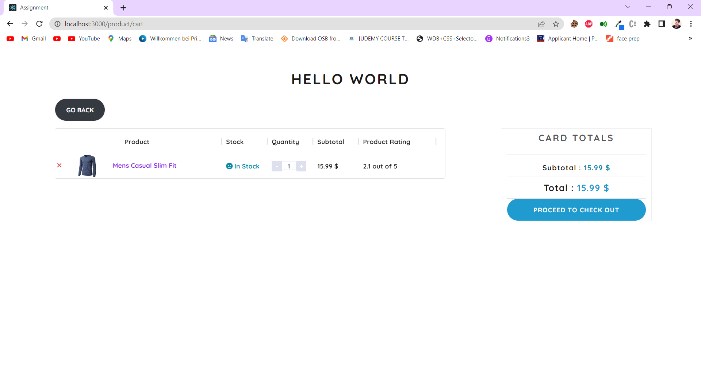
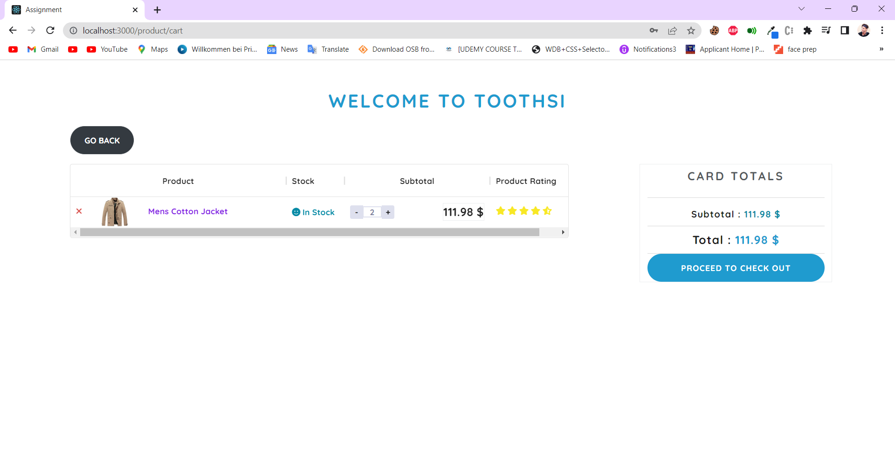
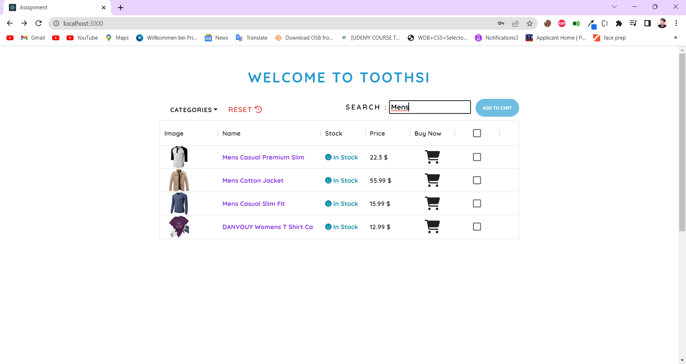

### NPM INSTALL

# Npm Start

## Look

<h3>Outline of the project </h3>
<h4 style="text-align:center;">Home Page</h4>

 
 
<h4 style="text-align:center;">Selection of the products</h4>

  
<h4 style="text-align:center;">Categories</h4>

  

<h4 style="text-align:center;">Category Page</h4>

 
 
<h4 style="text-align:center;">Cart Page</h4>

<h4>Cart Quantity Add UP</h4>

<h4>Search Option</h4>

<h3>Dependencies --used</h3>

  
 Axios --> for fetching the api

  
 react-router-dom --> for router

 Material UI , Bootstrap  --> for UI

